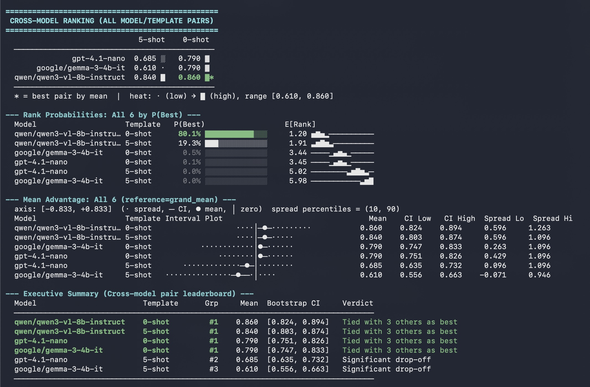

# evalstats

Utilities and guidance for statistically sane analyses for comparing prompt and LLM performance. Compute statistics and visualize the results.

`evalstats` helps you answer questions like:
 - Is Prompt A actually better than Prompt B, or just slightly luckier on this dataset?
 - Does Model A beat Model B, or only under a specific prompt phrasing?
 - How sensitive is model performance to prompt wording?
 - Are my performance differences large enough to be meaningful, or just noise?
 - How stable are scores across runs, evaluators, or inputs?
 - What statistics test should I run in X situation? 

The idea is simple: you give `evalstats` your benchmark data, and it runs statistically appropriate analyses that quantify uncertainty and provide confidence bounds on your claims. Datasets can include eval scores, prompts, inputs, evaluator names, and (optionally) models. `evalstats` provides:
- Plots and tests comparing prompt performance, with bootstrapped CIs and variance
- Plots and tests comparing model performance across prompt variations
- Constraints that guide you into performing best practices, like always considering prompt sensitivity when benchmarking model performance

As well, there is a "learning" guide in `website/` which I am building out. 
This will include simulation- and research-backed examples of statistics for LLM evals, 
as well as example code (which will, obviously, tend to use `evalstats`, but
the lessons hold regardless of implementation).  

> [!IMPORTANT]
> We are actively building out this project, both the website/guide and the package.
> If there's something you'd like to see, or guidance on a specific topic, let us know
> by raising an Issue.

## Sample output

Running `estats.analyze()` and then `estats.print_analysis_summary(analysis)` prints a full statistical report to the terminal, including confidence interval line plots, pairwise comparisons between prompt templates, and per-input stability across runs (how stable the model is across multiple runs for the same input). Below is example excerpt from an analysis of a 4-template sentiment-classification benchmark (GPT-4.1-nano, 27 inputs, 3 runs, 3 evaluators):


From this output, we can see that Minimal and Instructive are the most promising candidates, but it is statistically unclear which is better. We also see that Chain-of-thought gives the least consistent outputs across multiple runs for the same inputs, compared to the other methods. 

In the most recent version of `evalstats`, there's also helpful colors to help you see
this information. For instance, comparing models and prompts at the same time,
`evalstats` shows a 4-way tie between four combinations of model-prompt: 



You can also plot within notebook environments (although this feature is being actively built out over time and the least developed at the moment). The `plot_point_estimates` function produces a chart showing each template's absolute mean score with marginal confidence intervals:


## Statistics

The specific statistical tests the `evalstats.analyze()` method runs are:

- **All pairwise prompt comparisons (paired by input)** via `all_pairwise(...)`:
    - Computes mean or median difference (mean by default), bootstrapped 99% confidence interval, and p-value for every prompt template pair.
    - Comparison method defaults to `method="auto"`:
        - **Smoothed bootstrap with a Gaussian KDE** (`method="smooth_bootstrap"`) in situations of non-binary data. It has been verified in our simulations that for eval-type data and small sample sizes especially, smoothed is superior to the other bootstrap methods considered (percentile, BCa, Bayesian).
        - **Bayesian pairwise from [`bayes_evals`](https://github.com/sambowyer/bayes_evals/tree/main) and McNemar's test**: Default methods for binary scores (0 or 1 only). Our simulations showed Bayesian pairwise was superior to bootstrap at small N. Note that Bayesian methods should technically be called credible intervals, but they estimate the confidence interval very closely.  
    - Multiple-comparisons correction for p-values (defaults to **Benjamini–Hochberg (fdr_bh)**). 
    - Also reports Wilcoxon signed-rank test p-value, in case you need it for people familiar with that test, although p-values from bootstrapped CIs are more robust

- **Bootstrap rank distribution** via `bootstrap_ranks(...)`:
    - Estimates each prompt template’s `P(best)` and expected rank among the full list of prompt templates.

- **Point estimates** via `robustness_metrics(...)`:
    - Descriptive stats like mean, median, std, CV, IQR, CVaR-10, and key percentiles.
    - Marginal confidence intervals on absolute means/medians.

If your benchmark includes repeated runs (`R >= 3`), bootstrap-based analyses above use a **two-level nested bootstrap** (resample inputs, then runs within each input) so run-to-run stochasticity is propagated into CIs and rankings. In that case, `analyze()` also returns a seed/input variance decomposition via `seed_variance_decomposition(...)`.

If you set `method="lmm"`, `analyze()` switches to a mixed-effects path (`score ~ template + (1|input)`) with Wald CIs and parametric rank distributions. By default this uses `statsmodels` (pure Python, no additional setup required); pass `backend="pymer4"` to use R's lme4/emmeans instead (requires a separate R installation — see below). **Mixed effects model support is more experimental at the moment.**

## Installation and Quick start CLI

```bash
pip install evalstats
```

For Excel (`.xlsx`) input support:

```bash
pip install "evalstats[xlsx]"
```

For all optional extras (including mixed-effects/LMM support):

```bash
pip install "evalstats[all]"
```

From the command line, `evalstats` can read a CSV or Excel file directly and print a statistical summary:

```bash
evalstats analyze results.csv
```

The input file should have columns `template`, `input`, and `score` (run and evaluator columns are optional). Run `evalstats analyze --help` for the full list of options and supported column aliases.

For more complex statistical analysis with mixed effects models, use `method="lmm"`. The default `statsmodels` backend works out of the box; for the optional R-based backend, see below.

## Python API

`evalstats` main use case is as a Python API, which provides a similar entry point, the `analyze()` function. Simply pass your benchmark data in the correct format, and pass it to `analyze` to get a battery of results:

```python
import numpy as np
import evalstats as estats

# Example raw scores for 4 templates × 3 inputs (single run, single evaluator)
your_scores = [
    [0.91, 0.88, 0.86],
    [0.90, 0.89, 0.84],
    [0.85, 0.82, 0.80],
    [0.79, 0.76, 0.74],
]
n_templates = 4
n_inputs = 3

# scores shape: (n_templates, n_inputs, n_runs, n_evaluators)
# For a single evaluator and single run, shape is (N, M, 1, 1)
scores = np.array(your_scores).reshape(n_templates, n_inputs, 1, 1)

result = estats.BenchmarkResult(
    scores=scores,
    template_labels=["Minimal", "Instructive", "Few-shot", "Chain-of-thought"],
    input_labels=[f"input_{i}" for i in range(n_inputs)],
)

analysis = estats.analyze(result, reference="grand_mean", n_bootstrap=5_000)
estats.print_analysis_summary(analysis)
```

If your source data is already in a pandas DataFrame (possibly with noisy values), you can parse it directly and inspect a coercion report:

```python
import evalstats as estats

benchmark, load_report = estats.from_dataframe(
    df,
    format="auto",                  # auto / wide / long
    repair=True,                     # average duplicate cells + fill partial run slots
    strict_complete_design=True,     # set False to keep NaNs
    return_report=True,
)

for line in load_report.to_lines():
    print(line)

analysis = estats.analyze(benchmark)
```

To visualize absolute prompt performance with bootstrapped 99% confidence intervals:

```python
fig = estats.plot_point_estimates(result)
fig.savefig("mean_performance.png", dpi=150, bbox_inches="tight")
```

## Motivation

Most eval tools in the LLM evaluation space don't help users perform _any_ statistical tests, let alone showcase variances in performance between prompts or models. They instead present bar charts of average performance. Developers then glance at the bar chart and decide that "prompt/model A is better than B." But was it really?

Relying purely on bar charts and averages can very, very easily lead to erroneous conclusions—B might actually be more robust than A, or B performs well on an important subset of data, or there's not enough data to conclude one way or the other.

Why do people do evals this way? Well, they don't have the time, tools, or knowledge on how to do it better—frequently, they don't even know there's a better way.

`evalstats` aims to rectify this with simple, powerful defaults—just throw us your data and we'll run the stats and plot the results for you. Upstream applications, like LLM observability platforms, could take `evalstats` results and plot them in their own front-ends. Prompt optimization tools could also use `evalstats` to decide, e.g., when to cull a candidate prompt and how to present results to users.

## Examples

### Is one prompt "better" than others? Quantify uncertainty

When you have scores for multiple prompt templates across a set of inputs, `evalstats` computes bootstrapped 99% confidence intervals and pairwise significance tests so you can see not just which prompt scored highest on average, but how certain you can be about that ranking. It plots these to the terminal so you can check at a glance:


### Comparing across models while accounting for prompt sensitivity

A common failure mode in LLM benchmarking, both in academic papers and practitioner evaluations, is testing each model with a single prompt template and reporting the resulting scores as if they reflect stable model capabilities. In reality, model rankings can flip under semantically equivalent paraphrases of the same instruction. A benchmark result that says "Model A beats Model B" may be an artifact of prompt phrasing, not a meaningful capability difference. 

Here, we can see the difference between OpenAI's `gpt-4.1-nano` and MistralAI's `ministral-8b-2512` on a small sentiment classification benchmark, quantified by bootstrapped 99% confidence intervals:


In this run, multiple prompt template variations were considered, making this result more robust than trying a single prompt and calling it a day.

### How stable is the performance across runs?

LLMs are stochastic at temperature>0. Will the performance stay similar, even upon multiple runs for the same inputs? `evalstats` offers a helpful "noise plot" which visualizes (in)stability across runs:


## Running Example Scripts

We provide multiple standalone example scripts that rig up a simple benchmark, collect LLM responses, and run analyses over them. From the repository root, run any example script directly:

```bash
python examples/synthetic_mean_advantage.py
```

Additional examples:

```bash
# OpenAI sentiment benchmark (single run)
python examples/sentiment.py

# Multi-run variant (captures run-to-run variability)
python examples/sentiment_multirun.py

# Multi-model comparison across prompt templates
python examples/compare_models_multirun.py

# Manual API call walkthrough
python examples/sentiment_manual_api_calls.py
```

OpenAI-powered examples require `OPENAI_API_KEY` set in your environment. But, you can easily swap out the model calls to whatever model you prefer. 

## Mixed effects models (LMM)

> [!IMPORTANT]
> Mixed effects analysis is experimental, and currently offers only the advantage of gracefully
> dealing with missing data. In the future, we plan to add factor decomposition across multiple inputs.
> We recommend only using `method="lmm"` if you need robustness to missing data (`NaN`). Keep
> in mind that missing data must be reasonably random (i.e., like sampling from a larger distribution).

`evalstats` supports mixed-effects models (`score ~ template + (1|input)`) for:
- Missing data in inputs (some score cells are `NaN`)
- Factor decomposition when multiple input factors are present

### Default backend: statsmodels (pure Python)

No extra setup required — `statsmodels` is included in the standard `pip install evalstats`. Simply pass `method="lmm"`:

```python
analysis = estats.analyze(result, method="lmm")
```

`evalstats` fits the model with REML, computes Wald CIs via the delta method, and estimates rank distributions by parametric simulation.

### Optional backend: pymer4 (requires R)

For Satterthwaite degrees of freedom and `emmeans`-based pairwise contrasts (R's gold standard for mixed models), pass `backend="pymer4"`:

```python
analysis = estats.analyze(result, method="lmm", backend="pymer4")
```

This requires a working R installation with the following packages:

```r
install.packages(c(
    "lme4",
    "emmeans",
    "tibble",
    "broom",
    "broom.mixed",
    "lmerTest",
    "report",
    "car"
))
```

Then install the Python LMM extra:

```bash
pip install "evalstats[lmm]"
```

> [!NOTE]
> If your environment needs manual dependency pinning, this is the tested equivalent:
>
> ```bash
> pip install "pymer4>=0.9" great_tables joblib rpy2 polars scikit-learn formulae pyarrow
> ```

Installation details may differ on your system.

## Future and TODO

We aim to continue to contribute to `evalstats`. Ideas for future features:
- Mixed-effects models (LMMs and potentially GLMMs) for multi-input data. Currently, `evalstats` only supports the case of one input per prompt template, rather than a grid search (cross product) of different prompt variations.
- A default "report" mode that outputs a PDF summarizing findings and diving into the details
- Integration with ChainForge as a front-end, to bring statistical analyses to plotted evals
- Help developers quantify the "semantic variance" of the provided prompt templates, and perhaps even factor this into the calculation in an intelligent way. This is important because the current implementation doesn't know about the diversity/representativity of the input dataset and prompts. 
- Automatic "reliability" checking that generates minor prompt variations (e.g., lightly paraphrasing) and tests model robustness to small deviations. Implement various methods for generating minor prompt variations.

Another area of concern, but separate from the current focus on running stats over benchmarking scores, is helping users improve their eval and test set validity. Benchmark validity testing could use diagnostic tools from Item Response Theory, to converge on a smaller, higher-quality item set where every item is valuable (e.g., see Fluid Benchmarking). For each item in a set, know:
   - Difficulty: What proportion of model/prompt variants get this right? Near-zero items either have bad reference answers, are genuinely unanswerable, or represent a capability so far out of range it's not discriminating anything useful. Near-ceiling items inflate scores without adding signal.
   - Discrimination: Does performance on this item correlate with performance on the rest of the eval? A good item should be passed by models that do well overall and failed by models that do poorly. Low or negative discrimination is a red flag. Negative discrimination especially suggests the item may be flawed, ambiguous, or testing something orthogonal.

More practically speaking, we could:
 - Flag always-pass and always-fail items for removal or replacement. Replace them with items at a similar difficulty level to what the user intended but with better discriminating power.
 - Flag negative-discrimination items for inspection. These usually have one of a few problems: ambiguous wording where reasonable models disagree on interpretation, a flawed reference answer, or the item is actually measuring a different construct than the rest of the eval. Decide whether to fix or drop.
 - Cluster items by similarity, either by topic or by response pattern (items that all the same models pass/fail together). Prune to the most discriminating items in each cluster. After pruning, look for construct areas that lost too many items: the user may need to write better items for that region rather than leaving it underrepresented.
 - Benchmark distillation: Using an IRT-style approach similar to Fluid Benchmarking to find the most informative subset of eval items, and removing less informative ones. Could offer multiple methods for this, and simulations showing how they perform. E.g.: 
    - ```
        Full benchmark: 1200 items
        Distilled benchmark: 35 items
        Token savings: 96%
        Rank correlation: 0.94
      ```
 - Target a difficulty distribution: a well-designed benchmark has items spread across the difficulty range, with more items in the middle (where models are actually differentiated) than at the extremes. If the user's distribution is skewed too easy or hard, help them write targeted items to fill gaps.

## Development

For package build, release validation, and maintainer workflows, see [DEVELOPMENT.md](DEVELOPMENT.md).

## License

This repository uses two licenses:

- **`evalstats` package** (everything outside `website/`) — [MIT](LICENSE).
- **Stats for Evals Website** (everything in `website/`) — [CC BY-NC-ND 4.0](website/LICENSE). You may share it with attribution non-commercially, but commercial use and derivative works are not permitted. 
